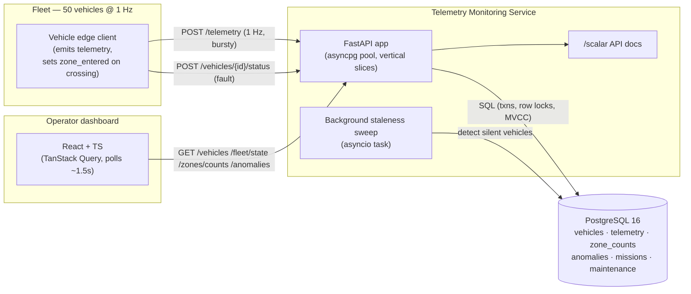

# 01 — System Context

Containers and the data that flows between them. The edge clients populate `zone_entered`; the API
owns persistence, anomaly detection, and the concurrency-safe operations; the dashboard is a
read-only poller.

**Notes.**
- Vertical slices inside the API: `telemetry · vehicles · zones · anomalies · fleet`.
- Ingestion absorbs bursts via the async connection pool; correctness under concurrency is enforced
  in the database (see [`../concurrency-and-isolation.md`](../concurrency-and-isolation.md)).
- The staleness sweep is the only thing that can detect *absence* of telemetry (offline vehicles).
- The dashboard holds no business logic; it validates responses with zod at the boundary.
