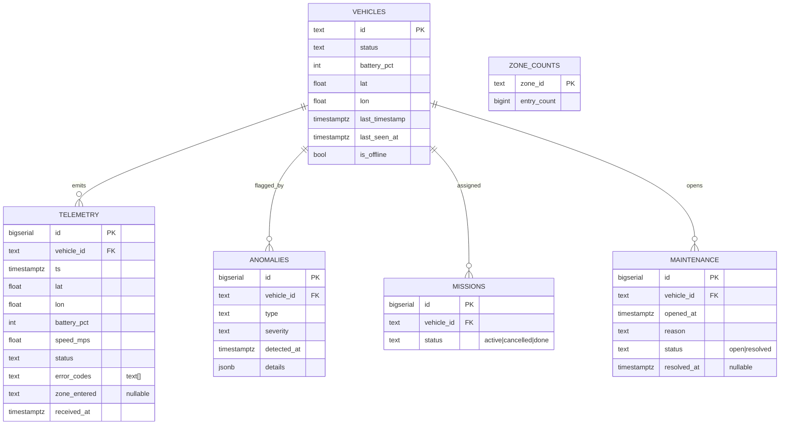

# 02 — Data Model (ER)

Six tables. `telemetry` is the append-only event log (source of truth). `vehicles` holds the
current snapshot per vehicle (the dashboard/aggregate read model). `zone_counts` is the O(1)
counter, reconstructable from `telemetry.zone_entered`.

**Key indexes & constraints.**
- `anomalies (vehicle_id, detected_at)` — fast "recent anomalies by vehicle and time range".
- `telemetry (vehicle_id, ts)` — per-vehicle history and dedupe by `(vehicle_id, ts)`.
- `maintenance` partial unique: `UNIQUE (vehicle_id) WHERE status = 'open'` — at most one open
  record per vehicle (the fault-idempotency backstop).
- `missions` partial unique: `UNIQUE (vehicle_id) WHERE status = 'active'` — at most one active
  mission per vehicle.
- `zone_counts` seeded with the 20 `ZONES` at startup so the atomic `UPDATE` always hits a row.
- The 50 `vehicles` (`v-1…v-50`) are seeded at startup too, so the fault-path `SELECT … FOR UPDATE`
  always finds a row to lock.
- `vehicles.is_offline` is maintained by the background staleness sweep — set when `last_seen_at` is
  older than the 10 s window, cleared on the next telemetry event. Offline state is *stored* (not
  only derived) so the dashboard renders it without recomputing.
- `missions.status`: `active` (managed here) and `cancelled` (set on fault) are the lifecycle this
  slice drives; `done` is reserved for external mission completion (missions are assigned
  externally) and is out of slice scope.
