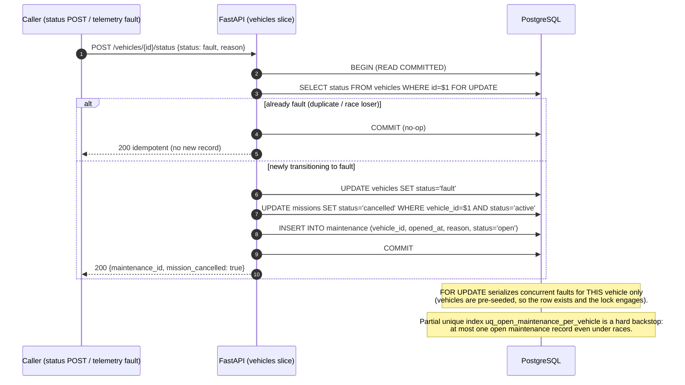

# 04 — Fault Transition Flow

A `fault` transition cancels the active mission and opens a maintenance record **atomically and
idempotently**, under a per-vehicle row lock. Concurrent or duplicate fault events for the same
vehicle produce exactly one maintenance record.

**Single source of truth.** This command is the *only* implementation of the fault invariant. The
telemetry slice delegates to it when an event arrives with `status = fault`, so the invariant is
never duplicated (DRY for a critical operation — see [`../architecture.md`](../architecture.md) §2).
