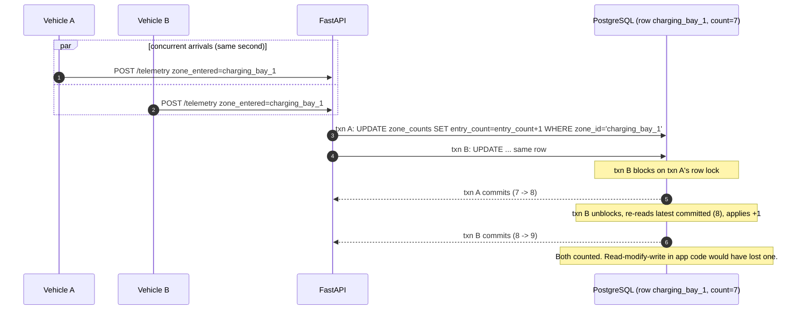

# 05 — Zone Counter Flow (concurrent, no lost update)

Two vehicles cross into `charging_bay_1` in the same instant. Both increments must land. The atomic
`UPDATE … = … + 1` row-locks the zone row, so the second transaction re-reads the latest committed
value before applying its increment.

**Proof.** `tests/test_zone_counter_concurrency.py` fires *N* concurrent same-zone events and
asserts the count equals exactly *N*. The append-only `telemetry` log lets counts be rebuilt if
ever needed.
